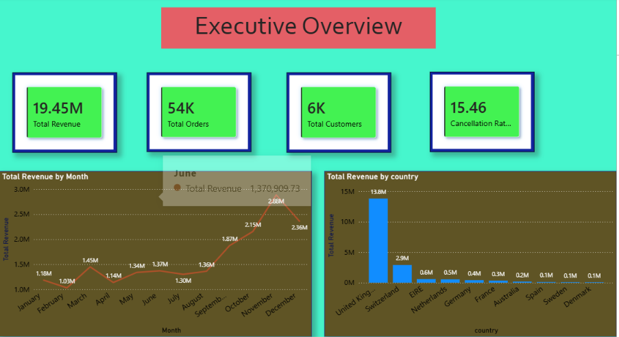
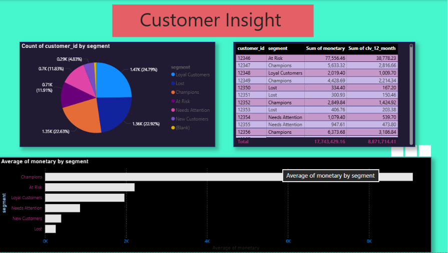
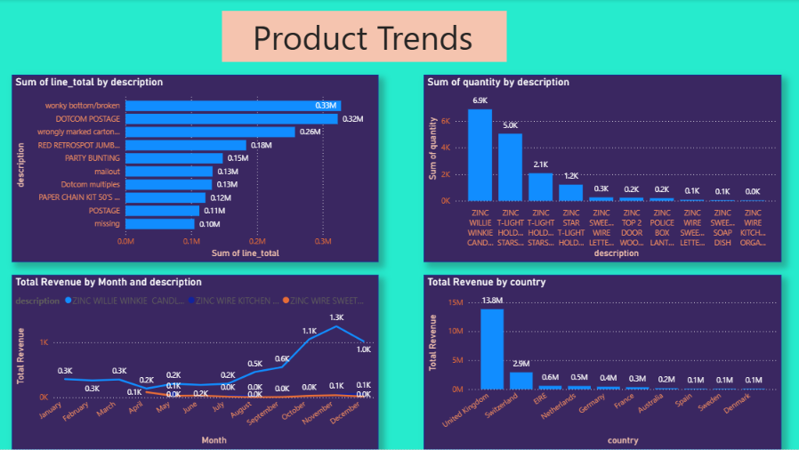

# Retail Sales Intelligence System

An end-to-end **data analytics project** covering the complete pipeline:

**Raw Transactional Data → SQL Data Modeling → Python Transformation → RFM Customer Segmentation → Power BI Dashboards → Business Recommendations**

This project simulates a real-world retail analytics workflow, transforming over **1 million raw transactions** into a structured, queryable, and decision-ready analytics system.

**Dataset:** [Online Retail II — UCI Machine Learning Repository](https://archive.ics.uci.edu/dataset/502/online+retail+ii)
**Dataset Size:** 1,067,371 transactions
**Period:** December 2009 – December 2011
**Business:** UK-based online retailer

---

## Problem Statement

Retail businesses generate large volumes of transactional data but often struggle to convert that data into actionable customer and product strategies.

This project simulates the workflow of a real data analyst by taking messy transactional data and transforming it into a decision-ready analytics system.

The project focuses on answering key business questions:

* Which customers generate the most revenue?
* Which customer segments are at risk of churn?
* Which products drive the most revenue and sales volume?
* How does revenue change over time?
* Which countries contribute the most revenue?
* How do data quality issues affect business analysis?

---

## Dashboard Preview

### Executive Overview

<p align="center">
  
</p>

High-level KPIs, monthly revenue trends, total orders, customer count, cancellation rate, and revenue by country.

### Customer Insights

<p align="center">
  
</p>

RFM customer segment distribution, average monetary value by segment, and customer-level CLV breakdown.

### Product Trends

<p align="center">
  
</p>

Top products by revenue and quantity, monthly product trends, and country-level revenue breakdown.

---

## Approach

### 1. Data Ingestion & Exploration — Python

The raw Excel dataset containing **1,067,371 rows** was loaded and profiled using Python.

Data quality issues identified included:

* Missing customer IDs — 22.77%
* Cancelled orders
* Negative quantities
* Duplicate rows
* Zero-price transactions
* Non-product and internal adjustment entries

The data was profiled before applying cleaning and transformation logic.

---

### 2. Database Design & ETL — MySQL + SQL

A normalized relational database was designed using MySQL.

The database contains:

* `customers`
* `products`
* `orders`
* `order_items`
* Staging table for raw transactional data

Cleaning and transformation logic included:

* Missing customer IDs were assigned to a `GUEST` segment rather than being discarded.
* Cancelled orders were flagged instead of deleted to preserve business trend visibility.
* Non-product entries and internal adjustment records were filtered from product-level analysis.
* Duplicate and invalid records were handled during the transformation process.

---

### 3. Customer Segmentation — SQL Window Functions

Customer segmentation was performed using **RFM analysis**:

* **Recency** — How recently the customer purchased
* **Frequency** — How frequently the customer purchased
* **Monetary** — How much the customer spent

SQL `NTILE()` window functions were used to calculate RFM scores.

A total of **5,942 customers** were segmented into six customer tiers:

1. Champions
2. Loyal Customers
3. At Risk
4. Needs Attention
5. New Customers
6. Lost

---

### 4. Customer Lifetime Value — Python

A simplified **12-month Customer Lifetime Value (CLV)** estimate was calculated using Python and pandas.

The calculated CLV values were then written back to MySQL, making them available for further SQL analysis and Power BI reporting.

---

### 5. Dashboarding — Power BI

An interactive three-page Power BI dashboard was created using a **live MySQL connection** rather than static CSV exports.

#### Executive Overview

Includes:

* Total Revenue
* Total Orders
* Total Customers
* Cancellation Rate
* Monthly Revenue Trend
* Revenue by Country

#### Customer Insights

Includes:

* RFM Segment Distribution
* Average Monetary Value by Segment
* Customer-level Monetary Value
* 12-Month CLV
* Customer Segmentation Analysis

#### Product Trends

Includes:

* Top Products by Revenue
* Top Products by Quantity
* Monthly Product Revenue Trends
* Country-level Revenue Analysis

---

## Key Findings

### 1. Champions Are the Highest-Value Customers

Champions represent approximately **22.6% of customers** and average around **₹8,996 in spend**.

This is nearly 5× the typical customer, making customer retention within this segment a major business priority.

### 2. At-Risk Customers Show High Spending Potential

At-Risk customers spend more on average than Loyal Customers:

**At Risk:** ₹2,214
**Loyal Customers:** ₹1,922

This indicates that the At-Risk segment contains valuable customers who may require targeted retention campaigns.

### 3. Guest Transactions Represent a Significant Share

Approximately **22.77% of transactions have unidentified customer IDs**.

Instead of dropping these transactions, they were preserved as a separate `GUEST` segment to maintain complete revenue visibility.

---

## Business Recommendations

Based on the analysis, the following strategies can be implemented:

### Retain Champions

* Provide loyalty rewards.
* Offer exclusive products or early access.
* Create personalized campaigns.
* Encourage repeat purchases.

### Target At-Risk Customers

* Launch personalized re-engagement campaigns.
* Provide targeted discounts.
* Recommend products based on previous purchases.
* Use CLV to prioritize high-value customers.

### Improve Customer Identification

The large percentage of guest transactions suggests an opportunity to improve customer identification during checkout.

Encouraging account creation or implementing stronger customer tracking can improve:

* Customer segmentation
* CLV calculation
* Retention analysis
* Personalized marketing

### Optimize Product Strategy

Products with consistently high revenue and quantity should be monitored for:

* Inventory planning
* Cross-selling opportunities
* Promotional campaigns
* Product bundling

---

## Tools & Technologies

| Layer                   | Technology                       |
| ----------------------- | -------------------------------- |
| Data Storage & Modeling | MySQL 8.0                        |
| Data Cleaning           | Python, Pandas                   |
| Database Connectivity   | SQLAlchemy                       |
| Customer Segmentation   | SQL, Window Functions, `NTILE()` |
| CLV Calculation         | Python, Pandas                   |
| Data Visualization      | Power BI                         |
| Dashboard Connection    | Live MySQL Connection            |
| Version Control         | Git / GitHub                     |

---

## Project Structure

```text
retail-sales-intelligence/
│
├── README.md
│
├── data/
│   ├── raw/
│   │   └── original dataset (not committed)
│   └── processed/
│
├── sql/
│   ├── schema.sql
│   ├── transform_data.sql
│   └── rfm_segmentation.sql
│
├── python/
│   ├── explore_data.py
│   ├── load_raw_data.py
│   └── calculate_clv.py
│
├── powerbi/
│   └── retail_dashboard.pbix
│
├── screenshots/
│   ├── executive_overview.png
│   ├── customer_insight.png
│   └── product_trends.png
│
└── docs/
    └── business_insights.md
```

---

## How to Run This Project

### 1. Clone the Repository

```bash
git clone https://github.com/YOUR_USERNAME/Retail-Sales-Intelligence.git
cd Retail-Sales-Intelligence
```

### 2. Set Up MySQL

Install **MySQL 8.0+** and create the database:

```sql
CREATE DATABASE retail_db;
```

### 3. Create the Database Schema

Run:

```text
sql/schema.sql
```

This creates the required tables and database structure.

### 4. Download the Dataset

Download the **Online Retail II** dataset from the UCI Machine Learning Repository and place the raw Excel file inside:

```text
data/raw/
```

Dataset:

[Online Retail II — UCI](https://archive.ics.uci.edu/dataset/502/online+retail+ii)

### 5. Load the Raw Data

Run:

```bash
python python/load_raw_data.py
```

This loads the raw transactional data into the MySQL staging table.

### 6. Transform the Data

Run:

```text
sql/transform_data.sql
```

This cleans and transforms the staging data into the normalized database tables.

### 7. Build RFM Segmentation

Run:

```text
sql/rfm_segmentation.sql
```

This calculates RFM scores and creates the customer segmentation logic.

### 8. Calculate Customer Lifetime Value

Run:

```bash
python python/calculate_clv.py
```

This calculates the simplified 12-month CLV for customers and writes the results back to MySQL.

### 9. Open the Power BI Dashboard

Open:

```text
powerbi/retail_dashboard.pbix
```

Connect Power BI to the local MySQL database:

```text
retail_db
```

The dashboard can then be refreshed using the MySQL data source.

---

## Data Quality Considerations

Several data quality issues were intentionally analyzed rather than simply removing problematic records.

| Issue                       | Treatment                              |
| --------------------------- | -------------------------------------- |
| Missing Customer IDs        | Preserved as `GUEST`                   |
| Cancelled Orders            | Flagged rather than deleted            |
| Negative Quantities         | Investigated as returns/cancellations  |
| Duplicate Records           | Identified and handled during cleaning |
| Zero-Price Transactions     | Investigated before analysis           |
| Internal Adjustment Entries | Removed from product-level analysis    |

This approach ensures that cleaning decisions do not unintentionally remove important business information.

---

## Business Insights

Detailed findings and recommendations are available here:

[View Business Insights](docs/business_insights.md)

---

## Dataset

This project uses the **Online Retail II** dataset provided by the UCI Machine Learning Repository.

The dataset contains transactions from a UK-based online retailer covering December 2009 through December 2011.

[View Dataset — UCI Machine Learning Repository](https://archive.ics.uci.edu/dataset/502/online+retail+ii)

---

## Skills Demonstrated

This project demonstrates practical experience in:

* SQL
* MySQL
* Database Design
* Data Cleaning
* ETL
* Python
* Pandas
* SQLAlchemy
* RFM Analysis
* Window Functions
* Customer Segmentation
* Customer Lifetime Value
* Power BI
* Data Visualization
* Business Analysis
* Data Storytelling
* Git & GitHub

---

## Project Highlights

* **1M+ raw transactions analyzed**
* **5,942 customers segmented**
* **RFM segmentation using SQL window functions**
* **12-month CLV calculated using Python**
* **Normalized MySQL data model**
* **Live MySQL → Power BI connection**
* **3-page interactive Power BI dashboard**
* **Business recommendations derived from data**

---

## Author

**Jay Kumar Patel**

B.Tech — Electronics & Communication Engineering
IIIT Ranchi

**Skills:** SQL • Python • Power BI • MySQL • Data Analytics

[LinkedIn](https://www.linkedin.com/in/jay-kumar-patel-597587292/)
